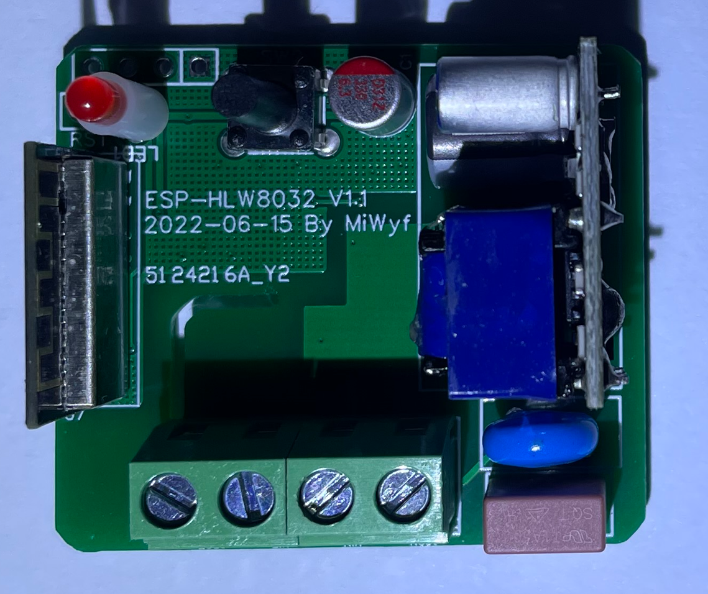

# ESP-HLW8032-Meter电表制作

## 接入Home Assistant效果:


## 硬件图:




加个外壳


## 软件:

这是使用罗总框架实现数据获取


这是使用ESPHome实现数据获取


## 资源:

HLW8032手册: [HLW8032_C128023.pdf](HLW8032_C128023.pdf)

BOM表和Gerber文件:  [ESP-HLW8032-2.zip](ESP-HLW8032-2.zip)

罗总框架实现的固件:  

ESPHome实现的代码:  [hlw8032.yaml](hlw8032.yaml)

HTML BOM: [ibom.html](ibom.html)

开源协议: GPL 3.0

hlw8032.yaml

```yaml
#################################################
        ##HLW8032 Energy V1.0##
######### 20220530 by MiWyf #####################

# Your secrets.yaml
#  wifi_ssid: 'ssid'    #WiFi_SSID名称
#  wifi_password: '12345678'    #WiFi密码
#  wifi_password_AP: '12345678'  #ap_WiFi密码
#  wifi_fast_connect: 'false'   #如果SSID是隐藏的，设置为true
#  wifi_reboot_timeout: 60s  #WiFi离线多久后重启设备，秒s/分钟min/小时h，不需要此功能设置为0s
#  ota_password: '12345678'    #OTA密码
#  api_password: '12345678'    #OTA密码
#  api_reboot_timeout: 0s  #与客户端（如Home Assistant）失去连接多久后重启设备，秒s/分钟min/小时h，不需要此功能设置为0s
#  mqtt_reboot_timeout: 0s

#################################################

substitutions:
  #Name your Gateway
  device_name: hlw8032
  #Home Assistant Name
  friendly_name: ESP HLW8032
  #Secret YAML is used for next data:
  api_pw: !secret api_password
  ota_pw: !secret ota_password

esphome:
  name: ${device_name}
  platform: ESP8266
  board: esp01_1m

# Enable logging
logger:
  #level: DEBUG

# Enable Home Assistant API
api:
  password: ${api_pw}
  reboot_timeout: 0s

# Enable OTA
ota:
  password: ${ota_pw}

#Enable WEB
web_server:
  port: 80

# Enable HA Time
time:
  - platform: homeassistant
    id: homeassistant_time

wifi:
  ssid: !secret wifi_ssid
  password: !secret wifi_password

  # Enable fallback hotspot (captive portal) in case wifi connection fails
  ap:
    ssid: "HLW8032"
    password: "12345678"

captive_portal:


#UART Settings
uart:
  rx_pin: 13
  baud_rate: 4800

sensor:
  - platform: uptime
    id: uptime_s
    update_interval: 60s
  - platform: cse7766
    #update_interval: 15s
    current:
      name: "${friendly_name} Current"
      filters:
        - lambda: return x / 1.88;
    voltage:
      name: "${friendly_name} Voltage"
      filters:
        - lambda: return x * 1.88;
    power:
      name: "${friendly_name} Power"
      filters:
#        - sliding_window_moving_average:
#            window_size: 10
#            send_every: 10
#            send_first_at: 1
        - lambda: return x * 1.88;
    energy:
      name: "${friendly_name} Energy"
      filters:
        - lambda: return x / 1.88 /1000;
        #- multiply: 0.001
      unit_of_measurement: kWh

# Extra sensor to keep track of gateway uptime
text_sensor:
  - platform: template
    name: "${friendly_name} Uptime"
    lambda: |-
      uint32_t dur = id(uptime_s).state;
      int dys = 0;
      int hrs = 0;
      int mnts = 0;
      if (dur > 86399) {
        dys = trunc(dur / 86400);
        dur = dur - (dys * 86400);
      }
      if (dur > 3599) {
        hrs = trunc(dur / 3600);
        dur = dur - (hrs * 3600);
      }
      if (dur > 59) {
        mnts = trunc(dur / 60);
        dur = dur - (mnts * 60);
      }
      char buffer[17];
      sprintf(buffer, "%ud %02uh %02um %02us", dys, hrs, mnts, dur);
      return {buffer};
    icon: mdi:clock-start
    update_interval: 60s
```


