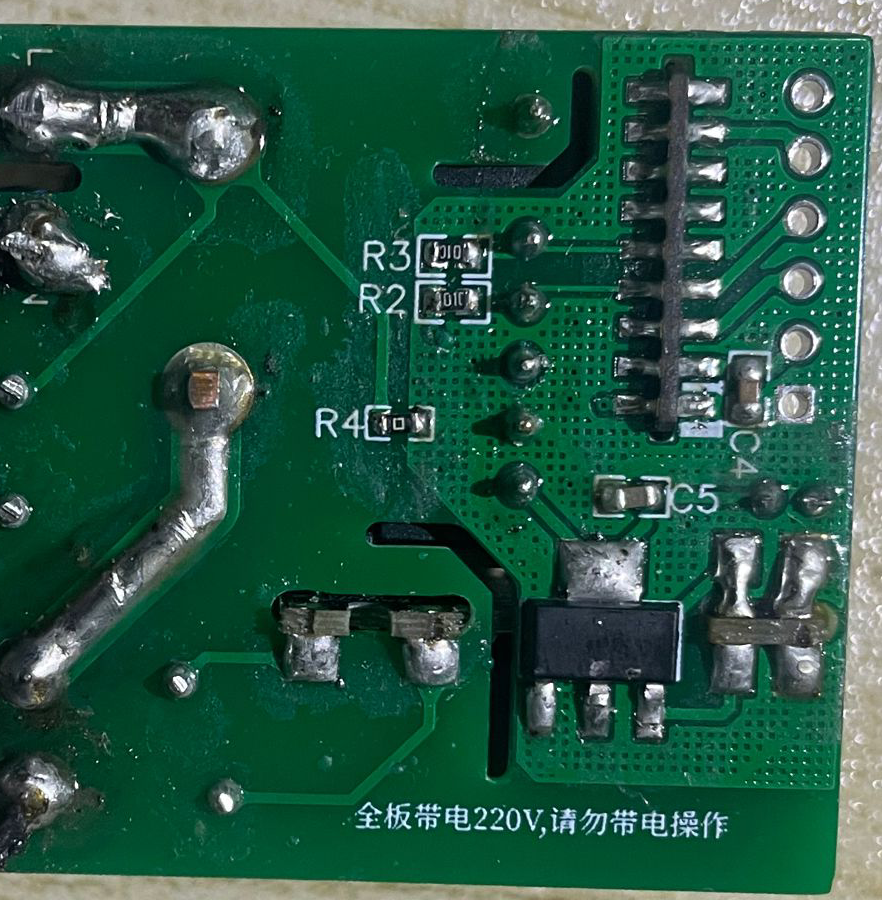

# ESP-IM1266-Meter电表制作

## 接入Home Assistant效果:


## 硬件图:




加个外壳


## 软件:

这是使用罗总框架实现数据获取


这是使用ESPHome实现数据获取


接入homeassistant


## 资源:

IM1266手册: [IM1266_C471615.pdf](IM1266_C471615.pdf)

BOM表和Gerber文件:  [EDP-IM1266-Meter.zip](EDP-IM1266-Meter.zip)

罗总框架实现的固件:  [esp8266_im1266_mb.bin](esp8266_im1266_mb.bin)

ESPHome实现的代码:  [im1266-mini.yaml](im1266-mini.yaml)

开源协议: GPL 3.0

im1266-mini.yaml

```yaml
#################################################
        ##IM1266 Energy V1.0##
######### 20220528 by MiWyf #####################

# Your secrets.yaml
#  wifi_ssid: 'ssid'    #WiFi_SSID名称
#  wifi_password: '12345678'    #WiFi密码
#  wifi_password_AP: '12345678'  #ap_WiFi密码
#  wifi_fast_connect: 'false'   #如果SSID是隐藏的，设置为true
#  wifi_reboot_timeout: 60s  #WiFi离线多久后重启设备，秒s/分钟min/小时h，不需要此功能设置为0s
#  ota_password: '12345678'    #OTA密码
#  api_password: '12345678'    #OTA密码
#  api_reboot_timeout: 0s  #与客户端（如Home Assistant）失去连接多久后重启设备，秒s/分钟min/小时h，不需要此功能设置为0s
#  mqtt_reboot_timeout: 0s

#################################################

substitutions:
  #Name your Gateway
  device_name: im1266-mini
  #Home Assistant Name
  friendly_name: ESP IM1266
  #Secret YAML is used for next data:
  api_pw: !secret api_password
  ota_pw: !secret ota_password

esphome:
  name: ${device_name}
  platform: ESP8266
  board: esp01_1m

# Enable logging
logger:
  level: DEBUG

# Enable Home Assistant API
api:
  password: ${api_pw}
  reboot_timeout: 0s

# Enable OTA
ota:
  password: ${ota_pw}

#Enable WEB
web_server:
  port: 80

# Enable HA Time
time:
  - platform: homeassistant
    id: homeassistant_time

wifi:
  ssid: !secret wifi_ssid
  password: !secret wifi_password

  # Enable fallback hotspot (captive portal) in case wifi connection fails
  ap:
    ssid: "IM1266"
    password: "12345678"

captive_portal:


#UART Settings
uart:
  id: mod_bus
  tx_pin: 12
  rx_pin: 14
  baud_rate: 4800
  stop_bits: 1

modbus:
  flow_control_pin: 13
  id: modbus1

modbus_controller:
  - id: epever
    ## the Modbus device addr
    address: 0x1
    modbus_id: modbus1
    setup_priority: -10

sensor:
  - platform: uptime
    id: uptime_s
    update_interval: 60s
  - platform: modbus_controller
    modbus_controller_id: epever
    name: "${device_name} Voltage"
    id: im1266_voltage
    register_type: holding
    address: 0x0048
    unit_of_measurement: "V"
    value_type: U_DWORD
    accuracy_decimals: 4
    filters:
      - multiply: 0.0001
  - platform: modbus_controller
    modbus_controller_id: epever
    name: "${device_name} Current"
    id: im1266_current
    register_type: holding
    address: 0x004A
    unit_of_measurement: "A"
    value_type: U_DWORD
    accuracy_decimals: 4
    filters:
      - multiply: 0.0001
  - platform: modbus_controller
    modbus_controller_id: epever
    name: "${device_name} Power"
    id: im1266_power
    register_type: holding
    address: 0x004C
    unit_of_measurement: "W"
    value_type: U_DWORD
    accuracy_decimals: 4
    filters:
      - multiply: 0.0001
  - platform: modbus_controller
    modbus_controller_id: epever
    name: "${device_name} Energy"
    id: im1266_energy
    register_type: holding
    address: 0x004E
    unit_of_measurement: "kWh"
    value_type: U_DWORD
    accuracy_decimals: 4
    filters:
      - multiply: 0.0001
  - platform: modbus_controller
    modbus_controller_id: epever
    name: "${device_name} PF"
    id: im1266_pf
    register_type: holding
    address: 0x0050
    unit_of_measurement: ""
    value_type: U_DWORD
    accuracy_decimals: 3
    filters:
      - multiply: 0.001
  - platform: modbus_controller
    modbus_controller_id: epever
    name: "${device_name} CO2"
    id: im1266_co2
    register_type: holding
    address: 0x0052
    unit_of_measurement: "Kg"
    value_type: U_DWORD
    accuracy_decimals: 4
    filters:
      - multiply: 0.0001
  - platform: modbus_controller
    modbus_controller_id: epever
    name: "${device_name} Temprature"
    id: im1266_temprature
    register_type: holding
    address: 0x0054
    unit_of_measurement: "°C"
    value_type: U_DWORD
    accuracy_decimals: 2
    filters:
      - multiply: 0.01
  - platform: modbus_controller
    modbus_controller_id: epever
    name: "${device_name} Frequency"
    id: im1266_frequency
    register_type: holding
    address: 0x0056
    unit_of_measurement: "Hz"
    value_type: U_DWORD
    accuracy_decimals: 2
    filters:
      - multiply: 0.01

# Extra sensor to keep track of gateway uptime
text_sensor:
  - platform: template
    name: "${friendly_name} Uptime"
    lambda: |-
      uint32_t dur = id(uptime_s).state;
      int dys = 0;
      int hrs = 0;
      int mnts = 0;
      if (dur > 86399) {
        dys = trunc(dur / 86400);
        dur = dur - (dys * 86400);
      }
      if (dur > 3599) {
        hrs = trunc(dur / 3600);
        dur = dur - (hrs * 3600);
      }
      if (dur > 59) {
        mnts = trunc(dur / 60);
        dur = dur - (mnts * 60);
      }
      char buffer[17];
      sprintf(buffer, "%ud %02uh %02um %02us", dys, hrs, mnts, dur);
      return {buffer};
    icon: mdi:clock-start
    update_interval: 60s
```


