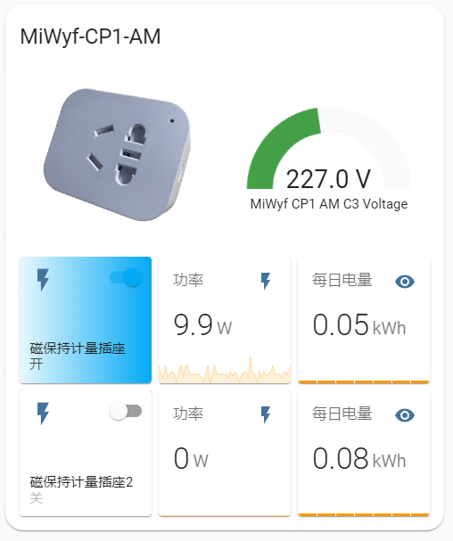
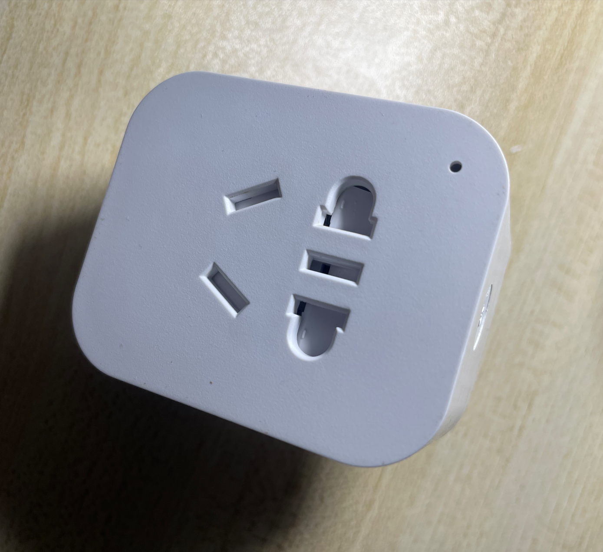
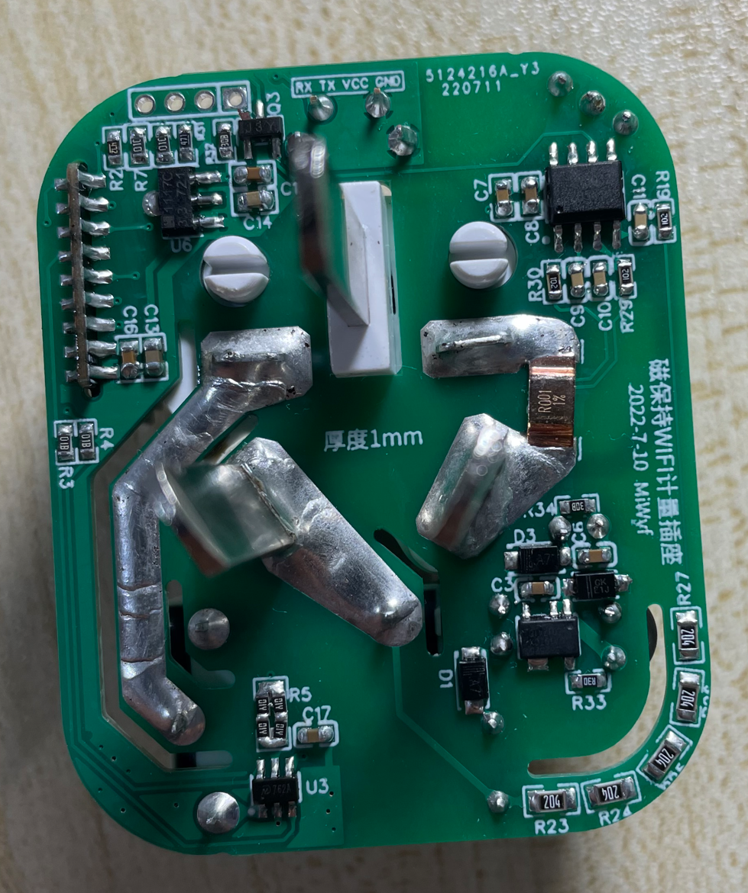
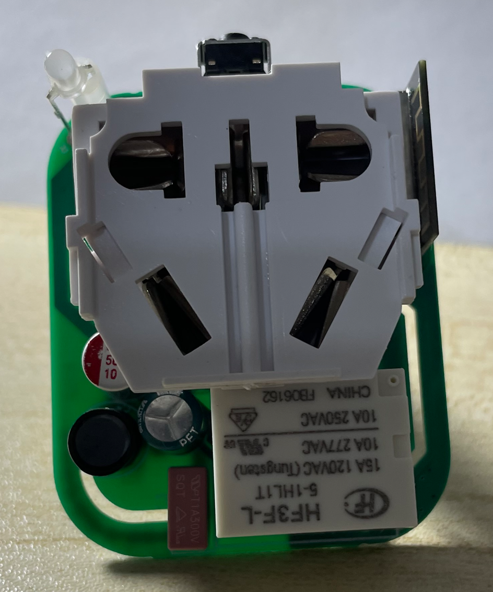
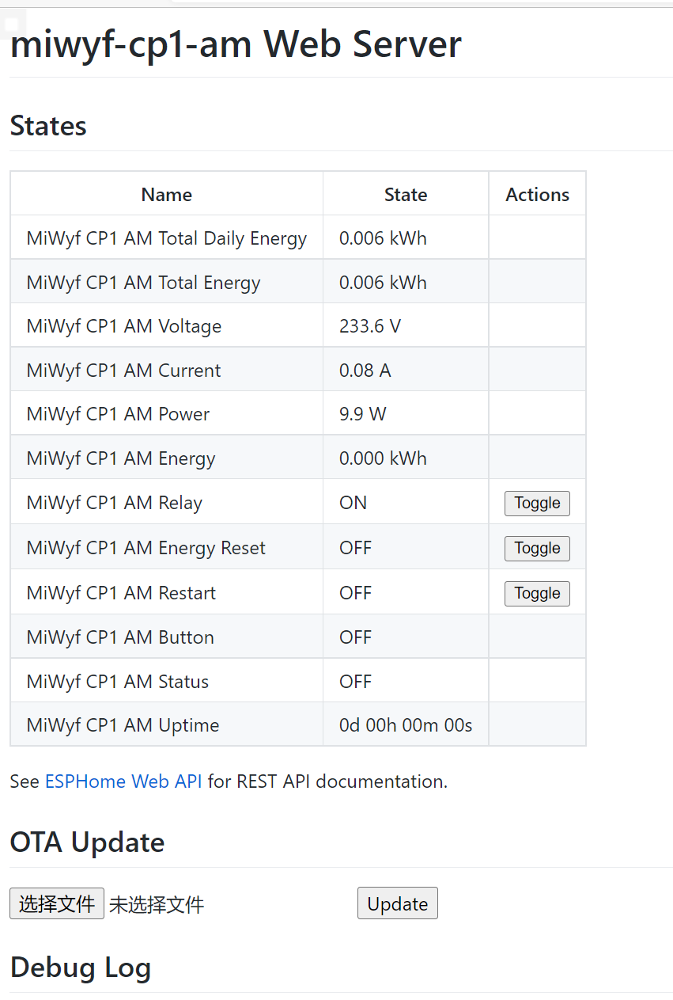

# ESP-SmartPlug-Meter WiFi磁保持计量插座制作

## 接入Home Assistant效果:





## 硬件图:







## 软件:

这是使用罗总框架实现数据获取

​	(暂时无)

这是使用ESPHome实现数据获取




## 资源:

本项目改进自(保留磁保持继电器,wifi改为ESP-01M模块,AC-DC改为分立元件,添加计量检测,优化驱动引脚)：

1.[[已验证\]磁保持WIFI智能插座(220V10A)](https://oshwhub.com/oldfox126/ci-bao-chi-wifi-zhi-neng-cha-zuo)

2.[【二次测试中】智能WiFi物联网插座](https://oshwhub.com/liyichuangeda/ji-yu-ESP12-de-shuang-lu-wu-xian-wu-lian-wang-kai-guan)

感谢作者 [oldfox126](https://oshwhub.com/oldfox126)和[御坂0x1BF52号](https://oshwhub.com/liyichuangeda) 大佬。

免责声明: 本设备为个人DIY研究使用,设备内220V电压,不对任何人复制制作产生的任何问题负责。

HLW8032手册: [HLW8032_C128023.pdf](HLW8032_C128023.pdf)

MD7620A手册: [MD7620A_C920529.pdf](MD7620A_C920529.pdf)

BP2525手册: [BP2525.pdf](BP2525.pdf)

## 制作:

BOM表和Gerber文件(厚度1.0mm):  [esp-smartplug-meter.zip](esp-smartplug-meter.zip)  按键用10-13mm高度的 , 板厚1.0, 电阻:200k/0805 1k/0603 普通精度1% , 高精度用0.1%

### 相关元件来源(或者参考原作者连接)：

1. [插座外壳（包括里面的220V10A公母一体插座）] -> [购买链接](https://detail.1688.com/offer/580420531460.html?spm=a261y.7663282.10811813088311.4.1317668c0RqiBd&sk=order)。
1. 侧按键（注意：要买H=5MM的）-> [购买链接](https://item.taobao.com/item.htm?spm=a1z09.2.0.0.29ff2e8dNjtkJ3&id=572935746768&_u=h1l4mhjd0b5)
1. 磁保持继电器K1（注意：要买HF3F-L-05-1HL1T(10A4脚)）-> [购买链接](https://item.taobao.com/item.htm?spm=a1z09.2.0.0.29ff2e8dNjtkJ3&id=650943984858&_u=h1l4mhjb5a1)
1. 磁保持继电器驱动芯片MD7620A SOT23-6 ->[购买链接](https://item.taobao.com/item.htm?spm=a1z09.2.0.0.29ff2e8dNjtkJ3&id=665356397463&_u=h1l4mhje8c1)


罗总框架实现的固件:  

ESPHome固件源码:  [miwyf-cp1-am.yaml](miwyf-cp1-am.yaml)

HTML BOM: [ibom.html](ibom.html)

开源协议: CC-BY-SA 3.0


miwyf-cp1-am.yaml

```yaml
#################################################
        ##MiWyf CP1 AM V1.0##
######### 20220709 by MiWyf #####################

# Your secrets.yaml
#  wifi_ssid: 'ssid'    #WiFi_SSID名称
#  wifi_password: '12345678'    #WiFi密码
#  wifi_password_AP: '12345678'  #ap_WiFi密码
#  wifi_fast_connect: 'false'   #如果SSID是隐藏的，设置为true
#  wifi_reboot_timeout: 60s  #WiFi离线多久后重启设备，秒s/分钟min/小时h，不需要此功能设置为0s
#  ota_password: '12345678'    #OTA密码
#  api_password: '12345678'    #OTA密码
#  api_reboot_timeout: 0s  #与客户端（如Home Assistant）失去连接多久后重启设备，秒s/分钟min/小时h，不需要此功能设置为0s
#  mqtt_reboot_timeout: 0s

#################################################

substitutions:
  #Name your Gateway
  device_name: miwyf-cp1-am
  #Home Assistant Name
  friendly_name: MiWyf CP1 AM
  #Secret YAML is used for next data:
  api_pw: !secret api_password
  ota_pw: !secret ota_password

#esphome:
#  name: ${device_name}
#  platform: ESP8266
#  board: esp01_1m
#  esp8266_restore_from_flash: true
#  #restore_from_flash: true
  
##new mode
esphome:
  name: ${device_name}
  #platformio_options:
    #platform: https://github.com/platformio/platform-espressif32.git#feature/arduino-upstream
    #board_build.flash_mode: dio
esp8266:
  board: esp01_1m
  framework:
    version: recommended
  restore_from_flash: true
  #board_flash_mode: dio
  ##for switch false
  #early_pin_init: false
  
preferences:
  #flash_write_interval: 1min
  flash_write_interval: 3s

# Enable logging
#logger:
#  level: DEBUG

# Enable Home Assistant API
api:
  password: ${api_pw}
  reboot_timeout: 0s

# Enable OTA
ota:
  password: ${ota_pw}

#Enable WEB
web_server:
  port: 80

# Enable HA Time
time:
  - platform: homeassistant
    id: homeassistant_time

wifi:
  ssid: !secret wifi_ssid
  password: !secret wifi_password

  # Enable fallback hotspot (captive portal) in case wifi connection fails
  ap:
    ssid: "${device_name}"
    password: "12345678"

captive_portal:

status_led:
  pin:
    number: GPIO2
    inverted: yes

  
binary_sensor:
  - platform: gpio
    pin:
      number: GPIO0
      mode:
        input: true
        pullup: true
      inverted: true
    name: "${friendly_name} Button"
    on_press:
      - switch.toggle: relay
  - platform: status
    name: "${friendly_name} Status"
#  - platform: gpio
#    pin: GPIO2
#    name: "${friendly_name} Sensor"


switch:
  - platform: gpio
    name: "${friendly_name} Relay"
    pin: GPIO13
    inverted: true
    id: relay
    on_turn_on:
      - switch.turn_off: ina
      - switch.turn_on: inb
      - delay: 100ms
      - switch.turn_off: ina
      - switch.turn_off: inb
      - delay: 100ms
    on_turn_off:
      - switch.turn_on: ina
      - switch.turn_off: inb
      - delay: 100ms
      - switch.turn_off: ina
      - switch.turn_off: inb
      - delay: 100ms
    
  - platform: gpio
    pin: GPIO5
    id: ina
  - platform: gpio
    pin: GPIO4
    id: inb
    
  - platform: template
    name: "${friendly_name} Energy Reset"
    icon: "mdi:switch"
    optimistic: true
    id: energy_reset
    #turn_off_action:
      #- sensor.integration.reset:  my_total_daily_energy 
    turn_on_action:
      - sensor.integration.reset: my_total_energy 
    
  - platform: restart
    name: "${friendly_name} Restart"

#UART Settings
uart:
  rx_pin: 14
  baud_rate: 4800
     
sensor:
  - platform: uptime
    id: uptime_s
    update_interval: 60s
  - platform: total_daily_energy
    id: my_total_daily_energy
    name: "${friendly_name} Total Daily Energy"
    power_id: my_power
    filters:
      - multiply: 0.001
    unit_of_measurement: kWh
  - platform: integration
    id: my_total_energy
    name: "${friendly_name} Total Energy" 
    sensor: my_power
    filters:
      - multiply: 0.001
    unit_of_measurement: kWh
    time_unit: h
    restore: true
    min_save_interval: 60s
  - platform: cse7766
    update_interval: 10s
    current:
      name: "${friendly_name} Current"
    voltage:
      name: "${friendly_name} Voltage"
    power:
      id: my_power
      name: "${friendly_name} Power"
      filters:
#        - sliding_window_moving_average:
#            window_size: 10
#            send_every: 10
#            send_first_at: 1
        - lambda: return x;
    energy:
      name: "${friendly_name} Energy"
      unit_of_measurement: kWh
      filters:
        - multiply: 0.001          
            
# Extra sensor to keep track of gateway uptime
text_sensor:
  - platform: template
    name: "${friendly_name} Uptime"
    lambda: |-
      uint32_t dur = id(uptime_s).state;
      int dys = 0;
      int hrs = 0;
      int mnts = 0;
      if (dur > 86399) {
        dys = trunc(dur / 86400);
        dur = dur - (dys * 86400);
      }
      if (dur > 3599) {
        hrs = trunc(dur / 3600);
        dur = dur - (hrs * 3600);
      }
      if (dur > 59) {
        mnts = trunc(dur / 60);
        dur = dur - (mnts * 60);
      }
      char buffer[17];
      sprintf(buffer, "%ud %02uh %02um %02us", dys, hrs, mnts, dur);
      return {buffer};
    icon: mdi:clock-start
    update_interval: 60s

```


