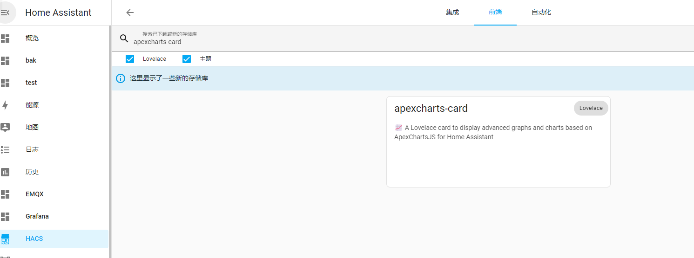

# HomeAssistant超级漂亮的界面

## 接入Home Assistant效果:


## 安装插件:

插件项目地址:[RomRider/apexcharts-card: 📈 A Lovelace card to display advanced graphs and charts based on ApexChartsJS for Home Assistant (github.com)](https://github.com/RomRider/apexcharts-card)

首先安装apexcharts-card插件,你可以直接安装也可以通过hacs




## 界面UI:

卡片的配置

1-1

```yaml
type: custom:apexcharts-card
experimental:
  color_threshold: true
graph_span: 24h
show:
  last_updated: true
header:
  standard_format: false
  show: true
  show_states: true
  colorize_states: true
  title: Living Room Temperature
now:
  show: true
  color: red
  label: Now
series:
  - entity: sensor.weather_temperature
    name: 室外温度
    type: line
    group_by:
      func: last
      duration: 5m
    stroke_width: 2
    show:
      extremas: true
      header_color_threshold: true
    color_threshold:
      - value: 18
        color: steelblue
      - value: 21
        color: midnightblue
      - value: 22
        color: orange
      - value: 23
        color: orangered
      - value: 26
        color: red
  - entity: sensor.weather_humidity
    name: 室外湿度
    stroke_width: 2
    show:
      in_chart: true
  - entity: sensor.0xa4c1380a60008845_temperature
    name: 客厅温度
    stroke_width: 2
    show:
      extremas: true
      header_color_threshold: true
  - entity: sensor.0xa4c1380a60008845_humidity
    name: 客厅湿度
    stroke_width: 2
    show:
      in_chart: true
```

1-2

```yaml
type: custom:apexcharts-card
experimental:
  color_threshold: true
graph_span: 24h
show:
  last_updated: true
header:
  standard_format: false
  show: true
  show_states: true
  colorize_states: true
  title: Home Energy
now:
  show: true
  color: red
  label: Now
span:
  end: hour
series:
  - entity: sensor.meter_power
    name: 总表
    type: line
    group_by:
      func: avg
      duration: 5m
    stroke_width: 2
    show:
      extremas: true
      header_color_threshold: true
    color_threshold:
      - value: 100
        color: steelblue
      - value: 800
        color: midnightblue
      - value: 1500
        color: orange
      - value: 2000
        color: orangered
      - value: 3000
        color: red
  - entity: sensor.relay_2053cd_power
    name: 客厅
    stroke_width: 2
    group_by:
      func: avg
      duration: 5min
  - entity: sensor.relay_ecf998_power
    name: 书房
    stroke_width: 2
    show:
      in_chart: true
    group_by:
      func: avg
      duration: 5min
  - entity: sensor.plug_158d0001b19931_power
    name: 冰箱
    stroke_width: 2
    show:
      in_chart: true
    group_by:
      func: avg
      duration: 5min
  - entity: sensor.cabinet_meter_power
    name: 机柜
    stroke_width: 2
    show:
      in_chart: true
    group_by:
      func: avg
      duration: 5min
  - entity: sensor.server_power
    name: R730XD
    stroke_width: 2
    show:
      in_chart: true
      extremas: true
      header_color_threshold: true
    group_by:
      func: avg
      duration: 5min
```

1-3

```yaml
type: custom:apexcharts-card
apex_config:
  chart:
    stacked: true
graph_span: 14d
span:
  end: day
show:
  last_updated: true
header:
  show: true
  show_states: true
  colorize_states: true
  title: 每日电费
series:
  - entity: sensor.meter_energy_daily_money
    name: 总表
    type: column
    color: darkviolet
    group_by:
      func: max
      duration: 1d
  - entity: sensor.relay_2053cd_daily_money
    name: 客厅
    type: column
    color: slateblue
    group_by:
      func: max
      duration: 1d
  - entity: sensor.relay_ecf998_daily_money
    name: 书房
    type: column
    color: orangered
    group_by:
      func: max
      duration: 1d
  - entity: sensor.plug_158d0001b19931_energy_daily_money
    name: 冰箱
    type: column
    color: orangered
    group_by:
      func: max
      duration: 1d
  - entity: sensor.cabinet_meter_energy_daily_money
    name: 机柜
    type: column
    color: orangered
    group_by:
      func: max
      duration: 1d
  - entity: sensor.server_powerusage_daily_money
    name: R730XD
    type: column
    color: orangered
    group_by:
      func: max
      duration: 1d
```

2-1

```yaml
type: custom:apexcharts-card
chart_type: pie
header:
  show: true
  show_states: true
  colorize_states: true
  title: Monthly Energy consumption in kWh
series:
  - entity: sensor.relay_2053cd_monthly
    name: 客厅
  - entity: sensor.relay_ecf998_monthly
    name: 书房
  - entity: sensor.plug_158d0001b19931_energy_monthly
    name: 冰箱
  - entity: sensor.cabinet_meter_energy_monthly
    name: 机柜
  - entity: sensor.server_powerusage_monthly
    name: R730XD
```

2-2

```yaml
type: custom:apexcharts-card
experimental:
  color_threshold: true
graph_span: 24h
show:
  last_updated: true
header:
  standard_format: false
  show: true
  show_states: true
  colorize_states: true
  title: Dell PowerEdge R730xd
now:
  show: true
  color: red
  label: Now
series:
  - entity: sensor.server_fans_speed_avg
    name: 机箱风扇
    type: line
    group_by:
      func: last
      duration: 5m
    stroke_width: 2
    show:
      extremas: true
      header_color_threshold: true
    color_threshold:
      - value: 18
        color: steelblue
      - value: 21
        color: midnightblue
      - value: 22
        color: orange
      - value: 23
        color: orangered
      - value: 26
        color: red
  - entity: sensor.rawdellserverfan1
    name: fan1
    stroke_width: 2
    show:
      in_chart: true
  - entity: sensor.rawdellserverfan2
    name: fan2
    stroke_width: 2
    show:
      extremas: true
      header_color_threshold: true
  - entity: sensor.rawdellserverfan3
    name: fan3
    stroke_width: 2
    show:
      in_chart: true
  - entity: sensor.rawdellserverfan4
    name: fan4
    stroke_width: 2
    show:
      in_chart: true
  - entity: sensor.rawdellserverfan5
    name: fan5
    stroke_width: 2
    show:
      in_chart: true
  - entity: sensor.rawdellserverfan6
    name: fan6
    stroke_width: 2
    show:
      in_chart: true
```

2-3

```yaml
type: custom:apexcharts-card
header:
  show: true
  title: R730XD Temperature Levels
  show_states: true
  colorize_states: true
chart_type: radialBar
series:
  - entity: sensor.server_cpu1_temperature
    name: CPU1温度
  - entity: sensor.server_cpu2_temperature
    name: CPU2温度
  - entity: sensor.server_inlet_temperature
    name: 入口温度
  - entity: sensor.server_exhaust_temperature
    name: 出口温度
```


## 资源:

1.HACS:[HACS (github.com)](https://github.com/hacs)

2.apexcharts-card: [RomRider/apexcharts-card: 📈 A Lovelace card to display advanced graphs and charts based on ApexChartsJS for Home Assistant (github.com)](https://github.com/RomRider/apexcharts-card)

开源协议: 请遵循原作者的开源协议


