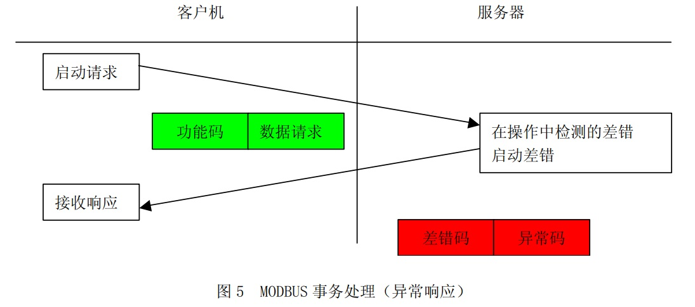
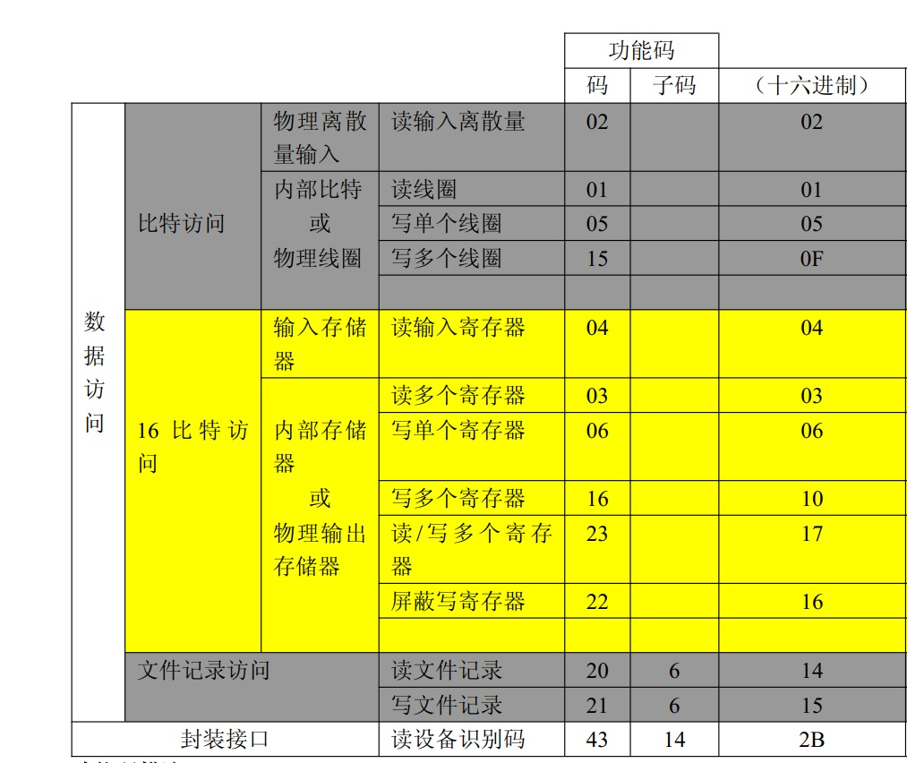

# （一）Modbus通讯协议简介

### **一、简介**

 　Modbus是一种串行通信协议，是Modicon公司于1979年为使用可编程逻辑控制器PLC通信而发表。Modbus是工业领域通信协议的业界标准，是工业电子设备之间常用的连接方式。Modbus在工业控制领域通信协议中被广泛使用基于以下几个特点：

1. 公开发表并且无版权要求；
2. 易于部署和维护；
3. 对供应商来说，修改移动本地的比特或字节没有很多限制。

### 二、Modbus通讯方式

1. 以太网上的 TCP/IP ；
2. 各种媒体（有线：EIA/TIA-232-E、EIA-422、EIA/TIA-485-A ；光纤、无线等）上的异步串行传输；Modbus RTU和Modbus ASCII通讯既是采用该方式；
3. Modbus Plus，一种高速令牌传递网络。

 

### 三、协议描述

　　Modbus协议定义了一个控制器能认识使用的消息结构,而不管它们是经过何种网络进行通信的。它描述了一控制器请求访问其它设备的过程，如果回应来自其它设备的请求，以及怎样侦测错误并记录。它制定了消息域格局和内容的公共格式。 　

　　通过此协议，控制器相互之间、或控制器经由网络（如以太网）可以和其它设备之间进行通信。Modbus协议使用的是主从通讯技术，即由主设备主动查询和操作从设备。一般将主控设备方所使用的协议称为Modbus Master，从设备方使用的协议称为Modbus Slave。典型的主设备包括工控机和工业控制器等；典型的从设备如PLC可编程控制器等。Modbus通讯物理接口可以选用串口（包括RS232、RS485和RS422），也可以选择以太网口。其通信遵循以下的过程：

1. 主设备（客户机）向从设备（服务器）发送请求；
2. 从设备（服务器）分析并处理主设备（客户机）的请求，然后向主设备（客户机）发送结果；
3. 如果出现任何差错，从设备（服务器）将返回一个异常功能码 。

　　当在一Modbus网络上通信时，此协议决定了每个控制器须要知道它们的设备地址，识别按地址发来的消息，决定要产生何种行动。如果需要回应，控制器将生成反馈信息并用Modbus协议发出。在其它网络上，包含了Modbus协议的消息转换为在此网络上使用的帧或包结构。这种转换也扩展了根据具体的网络解决节地址、路由路径及错误检测的方法。

　　Modbus的工作方式是请求/应答，每次通讯都是主站先发送指令，可以是广播，或是向特定从站单播，从站响应指令，并按要求应答，或者报告异常；当主站不发送请求时，从站不会自己发出数据，从站和从站之间不能直接通讯。

　　Modbus协议能够应用在不同类型的总线或者网络。对应不同的总线或网络，Modbus协议引入一些附加域映射成应用数据单元（ADU），即ADU = 附加域 + PDU。例如：

- RS232 / RS485 ADU = 253 字节+服务器地址(1 byte) + CRC (2 字节) = 256 字节 ；
- TCP MODBUS ADU = 249 字节+ MBAP (7 字节) = 256 字节 。

### 四、数据编码

　　MODBUS 使用一个‘big-Endian’ 表示地址和数据项。这意味着当发射多个字节时，首先发送最高有效位。 例如：

| Register size : 16 - bits | value: 0x1234 | the first byte sent is :0x12 | then:0x34 |
| ------------------------- | ------------- | ---------------------------- | --------- |
|                           |               |                              |           |

### 五、数据模型

　　MODBUS 以一系列具有不同特征表格上的数据模型为基础。四个基本表格为：

### 六、功能码

　　有三类Modbus功能码。分别是：

　　**1.公共功能码：**

- 是较好地被定义的功能码 ；
- 保证是唯一的；
- MODBUS 组织可改变的 ；
- 公开证明的 ；
- 具有可用的一致性测试 ；
- MB IETF RFC 中证明的 ；
- 包含已被定义的公共指配功能码和未来使用的未指配保留供功能码 。

　　**2.用户定义功能码：**

- 有两个用户定义功能码的定义范围，即 65 至 72 和十进制 100 至 110 ；
- 用户没有 MODBUS 组织的任何批准就可以选择和实现一个功能码 ；
- 不能保证被选功能码的使用是唯一的 ；
- 如果用户要重新设置功能作为一个公共功能码，那么用户必须启动 RFC，以便将改变引入公共分类中，并且指配一个新的公共功能码 。

　　**3.保留功能码：**

- 一些公司对传统产品通常使用的功能码，并且对公共使用是无效的功能码 。

　　**4.公共功能码定义如下表所示：**

****

# （二）Modbus RTU协议使用说明

### 一、Modbus RTU数据帧说明

　　由发送设备将 Modbus 报文构造为带有已知起始和结束标记的帧。这使设备可以在报文的开始接收新帧，并且知道何时报文结束。不完整的报文必须能够被检测到而错误标志必须作为结果被设置。在 RTU 模式，报文帧由时长至少为 3.5 个字符时间的空闲间隔区分。在后续的部分，这个时间区间被称作 t3.5。

　　整个报文帧必须以连续的字符流发送。如果两个字符之间的空闲间隔大于 1.5 个字符时间，则报文帧被认为不完整应该被接收节点丢弃。 

### 二、MODBUS指令说明

　　**1、读线圈寄存器01H**

　　1) 描述：

　　读MODBUS从机线圈寄存器当前状态。

　　2) 查询：

　　例如从机地址为0x11，线圈寄存器的起始地址为0x0013，结束地址为0x0037。该次查询总共访问(0x0037-0x0013 + 1)37个线圈寄存器。

|                               | Hex  |
| ----------------------------- | ---- |
| 从机地址(1个字节)             | 11   |
| 功能码(1个字节)               | 01   |
| 寄存器起始地址高字节(1个字节) | 00   |
| 寄存器起始地址低字节(1个字节) | 13   |
| 寄存器数量高字节(1个字节)     | 00   |
| 寄存器数量低字节(1个字节)     | 25   |
| CRC校验高字节(1个字节)        | 0E   |
| CRC校验低字节(1个字节)        | 84   |

　　3) 响应

　　响应负载中的各线圈状态与数据内容每位相对应。1代表ON，0代表OFF。若返回的线圈数不为8的倍数，则在最后数据字节未尾使用0代替。

|                                           | Hex  |
| ----------------------------------------- | ---- |
| 从机地址(1个字节)                         | 11   |
| 功能码(1个字节)                           | 01   |
| 返回字节数(1个字节)                       | 05   |
| 数据1（线圈0x001A - 线圈0x0013）(1个字节) | CD   |
| 数据2（线圈0x0022 - 线圈0x001B）(1个字节) | 6B   |
| 数据3（线圈0x002A - 线圈0x0023）(1个字节) | B2   |
| 数据4（线圈0x0032 - 线圈0x002B）(1个字节) | 0E   |
| 数据5（线圈0x0037 - 线圈0x0033）(1个字节) | 1B   |
| CRC校验高字节(1个字节)                    | 45   |
| CRC校验低字节(1个字节)                    | E6   |

　　线圈0x0013到线圈0x001A的状态为0xCD，二进制值为11001101，该字节的最高字节为线圈0x001A，最低字节为线圈0x0013。线圈0x001A到线圈0x0013的状态分别为ON-ON-OFF-OFF-ON-ON-OFF-ON。

| 0x001A | 0x0019 | 0x0018 | 0x0017 | 0x0016 | 0x0015 | 0x0014 | 0x0013 |
| ------ | ------ | ------ | ------ | ------ | ------ | ------ | ------ |
| ON     | ON     | OFF    | OFF    | ON     | ON     | OFF    | ON     |

　　最后一个数据字节中，线圈0x0033到线圈0x0037状态为0x1B(二进制00011011)，线圈0x0037是左数第4位，线圈0x0033为该字节的最低字节，线圈0x0037至线圈0x0033的状态分别为ON-ON-OFF-ON-ON，剩余3位使用0填充。

| 0x003A | 0x0039 | 0x0038 | 0x0037 | 0x0036 | 0x0035 | 0x0034 | 0x0033 |
| ------ | ------ | ------ | ------ | ------ | ------ | ------ | ------ |
| 填充   | 填充   | 填充   | ON     | ON     | OFF    | ON     | ON     |

 

　　**2、读离散输入寄存器 02H**

　　1) 说明

　　读离散输入寄存器状态。

　　2) 查询

　　从机地址为0x11。离散输入寄存器的起始地址为0x00C4，结束寄存器地址为0x00D9。总共访问(0x00D9-0x00C4+1)22个离散输入寄存器。

|                           | Hex  |
| ------------------------- | ---- |
| 从机地址(1个字节)         | 11   |
| 功能码(1个字节)           | 02   |
| 寄存器地址高字节(1个字节) | 00   |
| 寄存器地址低字节(1个字节) | C4   |
| 寄存器数量高字节(1个字节) | 00   |
| 寄存器数量低字节(1个字节) | 16   |
| CRC校验高字节(1个字节)    | BA   |
| CRC校验低字节(1个字节)    | A9   |

　　3) 响应

　　响应各离散输入寄存器状态，分别对应数据区中的每位值，1 代表ON；0 代表OFF。第一个数据字节的LSB(最低字节)为查询的寻址地址，其他输入口按顺序在该字节中由低字节向高字节排列，直到填充满8位。下一个字节中的8个输入位也是从低字节到高字节排列。若返回的输入位数不是8的倍数，则在最后的数据字节中的剩余位至该字节的最高位使用0填充。

|                                 | Hex  |
| ------------------------------- | ---- |
| 从机地址(1个字节)               | 11   |
| 功能码(1个字节)                 | 02   |
| 返回字节数(1个字节)             | 03   |
| 数据1(0x00CB - 0x00C4)(1个字节) | AC   |
| 数据1(0x00D3 - 0x00CC)(1个字节) | DB   |
| 数据1(0x00D9 - 0x00D4)(1个字节) | 35   |
| CRC校验高字节(1个字节)          | 20   |
| CRC校验低字节(1个字节)          | 18   |

　　离散输入寄存器0x00D4到0x00D9的状态为0x35 (二进制00110101)。输入寄存器0x00D9为左数第3位，输入寄存器0x00D4为最低位，输入寄存器0x00D9到0x00D4的状态分别为ON-ON-OFF-ON-OFF-ON。0x00DB寄存器和0x00DA寄存器被0填充。

| 0x00CB | 0x00CA | 0x00C9 | 0x00C8 | 0x00C7 | 0x00C6 | 0x00C5 | 0x00C4 |
| ------ | ------ | ------ | ------ | ------ | ------ | ------ | ------ |
| 0      | 0      | 1      | 1      | 0      | 1      | 0      | 1      |
| 0x00D3 | 0x00D2 | 0x00D1 | 0x00D0 | 0x00CF | 0x00CE | 0x00CD | 0x00CC |
| 1      | 1      | 1      | 0      | 1      | 0      | 1      | 1      |
| 0x00DB | 0x00DA | 0x00D9 | 0x00D8 | 0x00D7 | 0x00D6 | 0x00D5 | 0x00D4 |
| 填充   | 填充   | 1      | 1      | 0      | 1      | 0      | 1      |

　　**3、读保持寄存器 03H**

　　1) 说明
　　读保持寄存器。可读取单个或多个保持寄存器。
　　2) 查询
　　从机地址为0x11。保持寄存器的起始地址为0x006B，结束地址为0x006D。该次查询总共访问(0x006D-0x006B+1)3个保持寄存器。

|                           | Hex  |
| ------------------------- | ---- |
| 从机地址(1个字节)         | 11   |
| 功能码(1个字节)           | 03   |
| 寄存器地址高字节(1个字节) | 00   |
| 寄存器地址低字节(1个字节) | 6B   |
| 寄存器数量高字节(1个字节) | 00   |
| 寄存器数量低字节(1个字节) | 03   |
| CRC高字节(1个字节)        | 76   |
| CRC低字节(1个字节)        | 87   |

　　3) 响应
保持寄存器的长度为2个字节。对于单个保持寄存器而言，寄存器高字节数据先被传输，低字节数据后被传输。保持寄存器之间，低地址寄存器先被传输，高地址寄存器后被传输。

 

 

 

|                              | Hex  |
| ---------------------------- | ---- |
| 从机地址(1个字节)            | 11   |
| 功能码(1个字节)              | 03   |
| 字节数(1个字节)              | 06   |
| 数据1高字节(0x006B)(1个字节) | 00   |
| 数据1低字节(0x006B)(1个字节) | 6B   |
| 数据2高字节(0x006C)(1个字节) | 00   |
| 数据2低字节(0x006C)(1个字节) | 13   |
| 数据3高字节(0x006D)(1个字节) | 00   |
| 数据3低字节(0x006D)(1个字节) | 00   |
| CRC高字节(1个字节)           | 38   |
| CRC低字节(1个字节)           | B9   |

| 0x006B高字节 | 0x006B低字节 | 0x006C高字节 | 0x006C低字节 | 0x006D高字节 | 0x006D低字节 |
| ------------ | ------------ | ------------ | ------------ | ------------ | ------------ |
| 00           | 6B           | 00           | 13           | 00           | 00           |

　　**4、读输入寄存器 04H**

　　1) 说明
　　读输入寄存器命令。该命令支持单个寄存器访问也支持多个寄存器访问。
　　2) 查询
　　从机地址为0x11。输入寄存器的起始地址为0x0008，寄存器的结束地址为0x0009。本次访问访问2个读入寄存器。

|                               | Hex  |
| ----------------------------- | ---- |
| 从机地址(1个字节)             | 11   |
| 功能码(1个字节)               | 04   |
| 寄存器起始地址高字节(1个字节) | 00   |
| 寄存器起始地址低字节(1个字节) | 08   |
| 寄存器数量高字节(1个字节)     | 00   |
| 寄存器数量低字节(1个字节)     | 02   |
| CRC高字节(1个字节)            | F2   |
| CRC低字节(1个字节)            | 99   |

　　3) 响应
　　输入寄存器长度为2个字节。对于单个输入寄存器而言，寄存器高字节数据先被传输，低字节数据后被传输。输入寄存器之间，低地址寄存器先被传输，高地址寄存器后被传输。

|                              | Hex  |
| ---------------------------- | ---- |
| 从机地址(1个字节)            | 11   |
| 功能码(1个字节)              | 04   |
| 字节数(1个字节)              | 04   |
| 数据1高字节(0x0008)(1个字节) | 00   |
| 数据1低字节(0x0008)(1个字节) | 0A   |
| 数据2高字节(0x0009)(1个字节) | 00   |
| 数据2低字节(0x0009)(1个字节) | 0B   |
| CRC高字节(1个字节)           | 8B   |
| CRC低字节(1个字节)           | 80   |

| 0x0008高字节 | 0x0008低字节 | 0x0009高字节 | 0x0009低字节 |
| ------------ | ------------ | ------------ | ------------ |
| 0x00         | 0x0A         | 0x00         | 0x0B         |

　　**5、写单个线圈寄存器 05H**

　　1) 说明
　　写单个线圈寄存器。0xFF00值请求线圈处于ON状态，0x0000值请求线圈处于OFF状态。0x05指令设置单个线圈的状态，0x15指令可以设置多个线圈的状态，两个指令虽然都设定线圈的ON/OFF状态，但是ON/OFF的表达方式却不同。
　　2) 查询
　　从机地址为0x11，线圈寄存器的地址为0x00AC。使0x00AC线圈处于ON状态，即数据内容为0xFF00。

|                           | Hex  |
| ------------------------- | ---- |
| 从机地址(1个字节)         | 11   |
| 功能码(1个字节)           | 05   |
| 寄存器地址高字节(1个字节) | 00   |
| 寄存器地址低字节(1个字节) | AC   |
| 数据1高字节(1个字节)      | FF   |
| 数据1低字节(1个字节)      | 00   |
| CRC校验高字节(1个字节)    | 4E   |
| CRC校验低字节(1个字节)    | 8B   |

 

　　3) 响应

|                           | Hex  |
| ------------------------- | ---- |
| 从机地址(1个字节)         | 11   |
| 功能码(1个字节)           | 05   |
| 寄存器地址高字节(1个字节) | 00   |
| 寄存器地址低字节(1个字节) | AC   |
| 寄存器1高字节(1个字节)    | FF   |
| 寄存器1低字节(1个字节)    | 00   |
| CRC校验高字节(1个字节)    | 4E   |
| CRC校验低字节(1个字节)    | 8B   |

　　**6、写单个保持寄存器 06H**

　　1) 说明
　　写保持寄存器。注意0x06指令只能操作单个保持寄存器，0x16指令可以设置单个或多个保持寄存器。
　　2) 查询
　　从机地址为0x11。保持寄存器地址为0x0001。寄存器内容为0x0003。

|                           | Hex  |
| ------------------------- | ---- |
| 从机地址(1个字节)         | 11   |
| 功能码(1个字节)           | 06   |
| 寄存器地址高字节(1个字节) | 00   |
| 寄存器地址低字节(1个字节) | 01   |
| 数据1高字节(1个字节)      | 00   |
| 数据1低字节(1个字节)      | 01   |
| CRC校验高字节(1个字节)    | 9A   |
| CRC校验低字节(1个字节)    | 9B   |

　　3) 响应

|                           | Hex  |
| ------------------------- | ---- |
| 从机地址(1个字节)         | 11   |
| 功能码(1个字节)           | 06   |
| 寄存器地址高字节(1个字节) | 00   |
| 寄存器地址低字节(1个字节) | 01   |
| 寄存器数量高字节(1个字节) | 00   |
| 寄存器数量低字节(1个字节) | 01   |
| CRC校验高字节(1个字节)    | 1B   |
| CRC校验低字节(1个字节)    | 5A   |

　　**7、写多个线圈寄存器 0FH**

　　1) 说明
　　写多个线圈寄存器。若数据区的某位值为“1”表示被请求的相应线圈状态为ON，若某位值为“0”，则为状态为OFF。
　　2) 查询
　　从机地址为0x11，线圈寄存器的起始地址为0x0013，线圈寄存器的结束地址为0x001C。总共访问(0x001C-0x0013+1)10个寄存器。寄存器内容如下表所示。

| 0x001A | 0x0019 | 0x0018 | 0x0017 | 0x0016 | 0x0015 | 0x0014 | 0x0013 |
| ------ | ------ | ------ | ------ | ------ | ------ | ------ | ------ |
| 1      | 1      | 0      | 0      | 1      | 1      | 0      | 1      |
| 0x0022 | 0x0021 | 0x0020 | 0x001F | 0x001E | 0x001D | 0x001C | 0x001B |
| 0      | 0      | 0      | 0      | 0      | 0      | 0      | 1      |

　　传输的第一个字节0xCD对应线圈为0x0013到0x001A，LSB（最低位）对应线圈0x0013，传输第二个字节为 0x01，对应的线圈为0x001B到0x001C，LSB对应线圈0x001C，其余未使用位使用0填充。

|                                 | Hex  |
| ------------------------------- | ---- |
| 从机地址(1个字节)               | 11   |
| 功能码(1个字节)                 | 0F   |
| 寄存器地址高字节(1个字节)       | 00   |
| 寄存器地址低字节(1个字节)       | 13   |
| 寄存器数量高字节(1个字节)       | 00   |
| 寄存器数量低字节(1个字节)       | 0A   |
| 字节数(1个字节)                 | 02   |
| 数据1(0x0013 - 0x001A)(1个字节) | CD   |
| 数据2(0x001B - 0x001C)(1个字节) | 01   |
| CRC校验高字节(1个字节)          | BF   |
| CRC校验低字节(1个字节)          | 0B   |

　　3) 响应

|                           | Hex  |
| ------------------------- | ---- |
| 从机地址(1个字节)         | 11   |
| 功能码(1个字节)           | 0F   |
| 寄存器地址高字节(1个字节) | 00   |
| 寄存器地址低字节(1个字节) | 13   |
| 寄存器数量高字节(1个字节) | 00   |
| 寄存器数量低字节(1个字节) | 0A   |
| 字节数(1个字节)           | 02   |
| CRC校验高字节(1个字节)    | 99   |
| CRC校验低字节(1个字节)    | 1B   |

　　**8、写多个保持寄存器10H**

　　1) 说明
　　写多个保持寄存器。
　　2) 查询
　　从机地址为0x11。保持寄存器的起始地址为0x0001，寄存器的结束地址为0x0002。总共访问(0x0002-0x0001+1)2个寄存器。保持寄存器0x0001的内容为0x000A，保持寄存器0x0002的内容为0x0102。

|                               | Hex  |
| ----------------------------- | ---- |
| 从机地址(1个字节)             | 11   |
| 功能码(1个字节)               | 10   |
| 寄存器起始地址高字节(1个字节) | 00   |
| 寄存器起始地址低字节(1个字节) | 01   |
| 寄存器数量高字节(1个字节)     | 00   |
| 寄存器数量低字节(1个字节)     | 02   |
| 字节数(1个字节)               | 04   |
| 数据1高字节(1个字节)          | 00   |
| 数据1低字节(1个字节)          | 0A   |
| 数据2高字节(1个字节)          | 01   |
| 数据2低字节(1个字节)          | 02   |
| CRC校验高字节(1个字节)        | C6   |
| CRC校验低字节(1个字节)        | F0   |

| 地址 | 0x0001高字节 | 0x0001低字节 | 0x0002高字节 | 0x0002低字节 |
| ---- | ------------ | ------------ | ------------ | ------------ |
| 数值 | 0x00         | 0x0A         | 0x01         | 0x02         |

　　3) 响应

|                               | Hex  |
| ----------------------------- | ---- |
| 从机地址(1个字节)             | 11   |
| 功能码(1个字节)               | 10   |
| 寄存器起始地址高字节(1个字节) | 00   |
| 寄存器起始地址低字节(1个字节) | 01   |
| 寄存器数量高字节(1个字节)     | 00   |
| 寄存器数量低字节(1个字节)     | 02   |
| CRC校验高字节(1个字节)        | 12   |
| CRC校验低字节(1个字节)        | 98   |

# （三）Modbus TCP协议使用说明

### 一、Modbus TCP数据帧

　　ModbusTCP的数据帧可分为两部分：**MBAP**+**PDU**。

　　在 TCP/IP 上使用一种专用报文头识别 MODBUS 应用数据单元。将这种报文头称为 MBAP 报文头（MODBUS 协议报文头）。这种报文头提供一些与串行链路上使用的 MODBUS RTU 应用数据单元比较的差别 ：

1.  用 MBAP 报文头中的单个字节单元标识符取代 MODBUS 串行链路上通常使用的 MODBUS从地址域。这个单元标识符用于设备的通信，这些设备使用单个IP地址支持多个独立Modbus终端单元，例如：网桥、路由器和网关。
2. 用接收者可以验证完成报文的方式设计所有 MODBUS 请求和响应。对于 MODBUS PDU有固定长度的功能码来说，仅功能码就足够了。对于在请求或响应中携带一个可变数据的功能码来说，数据域包括字节数。
3. 当在 TCP 上携带 MODBUS 时，即使将报文分成多个信息包来传输，办事在 MBAP 报文头上携带附加长度信息，以便接收者能识别报文边界。显式和隐式长度规则的存在以及CRC-32 差错校验码的使用（在以太网上）将对请求或响应报文产生极小的未检出干扰。 

### **二、MBAP报文头**

　　原文链接：https://www.cnblogs.com/ioufev/articles/10830028.html

　　MBAP的长度为7个字节，组成如下：

　　

| 事务处理标识 | 协议标识 | 长度  | 单元标识符 |
| :----------: | -------- | ----- | ---------- |
|    2字节     | 2字节    | 2字节 | 1字节      |

 

| 内容             |                             解释                             |
| ---------------- | :----------------------------------------------------------: |
| **事务处理标识** | 可以理解为报文的序列号，一般每次通信之后就要加1以区别不同的通信数据报文。 |
| **协议标识符**   |                   00 00表示ModbusTCP协议。                   |
| **长度**         |              表示接下来的数据长度，单位为字节。              |
| **单元标识符**   |                     可以理解为设备地址。                     |

 

### 四、**帧结构PDU**

 

　　PDU由功能码+数据组成。功能码为1字节，数据长度不定，由具体功能决定。

　　**功能码**

　　Modbus的操作对象有四种：线圈、离散输入、输入寄存器、保持寄存器。

| 对象       | 含义                                                |
| ---------- | --------------------------------------------------- |
| 线圈       | PLC的输出位，开关量，在Modbus中可读可写             |
| 离散量     | PLC的输入位，开关量，在Modbus中只读                 |
| 输入寄存器 | PLC中只能从模拟量输入端改变的寄存器，在Modbus中只读 |
| 保持寄存器 | PLC中用于输出模拟量信号的寄存器，在Modbus中可读可写 |

　　根据对象的不同，常用的Modbus的功能码有：

| 功能码 |       含义       |
| ------ | :--------------: |
| 0x01   |      读线圈      |
| 0x05   |    写单个线圈    |
| 0x0F   |    写多个线圈    |
| 0x02   |   读离散量输入   |
| 0x04   |   读输入寄存器   |
| 0x03   |   读保持寄存器   |
| 0x06   | 写单个保持寄存器 |
| 0x10   | 写多个保持寄存器 |

 

　　**0x01：读线圈**

　　在从站中读1~2000个连续线圈状态，ON=1,OFF=0

- 请求：MBAP 功能码 起始地址H 起始地址L 数量H 数量L（共12字节）
- 响应：MBAP 功能码 数据长度 数据（一个地址的数据为1位）
- 如：在从站0x01中，读取开始地址为0x0002的线圈数据，读0x0008位
  00 01 00 00 00 06 01 01 00 02 00 08
- 回：数据长度为0x01个字节，数据为0x01，第一个线圈为ON，其余为OFF
  00 01 00 00 00 04 01 01 01 01

　　**0x05：写单个线圈**
　　将从站中的一个输出写成ON或OFF，0xFF00请求输出为ON,0x000请求输出为OFF

- 请求：MBAP 功能码 输出地址H 输出地址L 输出值H 输出值L（共12字节）
- 响应：MBAP 功能码 输出地址H 输出地址L 输出值H 输出值L（共12字节）
- 如：将地址为0x0003的线圈设为ON
  00 01 00 00 00 06 01 05 00 03 FF 00
- 回：写入成功
  00 01 00 00 00 06 01 05 00 03 FF 00

　　**0x0F：写多个线圈**
　　将一个从站中的一个线圈序列的每个线圈都强制为ON或OFF，数据域中置1的位请求相应输出位ON，置0的位请求响应输出为OFF

- 请求：MBAP 功能码 起始地址H 起始地址L 输出数量H 输出数量L 字节长度 输出值H 输出值L
- 响应：MBAP 功能码 起始地址H 起始地址L 输出数量H 输出数量L

　　**0x02：读离散量输入**
　　从一个从站中读1~2000个连续的离散量输入状态

- 请求：MBAP 功能码 起始地址H 起始地址L 数量H 数量L（共12字节）
- 响应：MBAP 功能码 数据长度 数据（长度：9+ceil（数量/8））
- 如：从地址0x0000开始读0x0012个离散量输入
  00 01 00 00 00 06 01 02 00 00 00 12
- 回：数据长度为0x03个字节，数据为0x01 04 00，表示第一个离散量输入和第11个离散量输入为ON，其余为OFF
  00 01 00 00 00 06 01 02 03 01 04 00

　　**0x04：读输入寄存器**
　　从一个远程设备中读1~2000个连续输入寄存器

- 请求：MBAP 功能码 起始地址H 起始地址L 寄存器数量H 寄存器数量L（共12字节）
- 响应：MBAP 功能码 数据长度 寄存器数据(长度：9+寄存器数量×2)
- 如：读起始地址为0x0002，数量为0x0005的寄存器数据
  00 01 00 00 00 06 01 04 00 02 00 05
- 回：数据长度为0x0A，第一个寄存器的数据为0x0c，其余为0x00
  00 01 00 00 00 0D 01 04 0A 00 0C 00 00 00 00 00 00 00 00

　　**0x03：读保持寄存器**
　　从远程设备中读保持寄存器连续块的内容

- 请求：MBAP 功能码 起始地址H 起始地址L 寄存器数量H 寄存器数量L（共12字节）
- 响应：MBAP 功能码 数据长度 寄存器数据(长度：9+寄存器数量×2)
- 如：起始地址是0x0000，寄存器数量是 0x0003
  00 01 00 00 00 06 01 03 00 00 00 03
- 回：数据长度为0x06，第一个寄存器的数据为0x21，其余为0x00
  00 01 00 00 00 09 01 03 06 00 21 00 00 00 00

　　**0x06：写单个保持寄存器**
　　在一个远程设备中写一个保持寄存器

- 请求：MBAP 功能码 寄存器地址H 寄存器地址L 寄存器值H 寄存器值L（共12字节）
- 响应：MBAP 功能码 寄存器地址H 寄存器地址L 寄存器值H 寄存器值L（共12字节）
- 如：向地址是0x0000的寄存器写入数据0x000A
  00 01 00 00 00 06 01 06 00 00 00 0A
- 回：写入成功
  00 01 00 00 00 06 01 06 00 00 00 0A

　　**0x10：写多个保持寄存器**
　　在一个远程设备中写连续寄存器块（1~123个寄存器）

- 请求：MBAP 功能码 起始地址H 起始地址L 寄存器数量H 寄存器数量L 字节长度 寄存器值（13+寄存器数量×2）
- 响应：MBAP 功能码 起始地址H 起始地址L 寄存器数量H 寄存器数量L（共12字节）
- 如：向起始地址为0x0000，数量为0x0001的寄存器写入数据，数据长度为0x02，数据为0x000F
  00 01 00 00 00 09 01 10 00 00 00 01 02 00 0
- 回：写入成功
  00 01 00 00 00 06 01 10 00 00 00 01

### 五、Modbus TCP示例报文

　　ModBusTcp与串行链路Modbus的数据域是一致的，具体数据域可以参考串行Modbus。这里给出几个ModbusTcp的链路解析说明，辅助新人分析报文。

　　原文链接：https://blog.csdn.net/mikasoi/article/details/81782159

　　1、数据请求

| 97 76 00 00 00 06 04 04 00 7D 00 7D |        |                  |                                                        |                                          |
| ----------------------------------- | ------ | ---------------- | ------------------------------------------------------ | ---------------------------------------- |
|                                     | 示例   | 长度             | 说明                                                   | 备注                                     |
| Map报文头                           | 0x97   | 1                | 事务处理标识符Hi                                       | 客户机发起，服务器复制，用于事务处理配对 |
| 0x96                                | 1      | 事务处理标识符Lo |                                                        |                                          |
| 0x0000                              | 2      | 协议标识符号     | 客户机发起，服务器复制Modbus协议 = 0.                  |                                          |
| 0x0006                              | 2      | 长度             | 从本字节下一个到最后                                   |                                          |
| 0x04                                | 1      | 单元标识符       | 客户机发起，服务器复制串口链路或其他总线上远程终端标识 |                                          |
| 功能码                              | 0x04   | 1                | 功能码，读寄存器                                       | 参考标准modbus协议                       |
| 数据                                | 0x007D | 2                | 起始地址                                               |                                          |
| 0x 007D                             | 2      | 寄存器数量       |                                                        |                                          |
| 校验                                |        |                  |                                                        |                                          |

　　2、数据请求回复

| 97 76 00 00 00 FD 04 04 FA AB 9E 41 18 7A E1 3F 94 7A E1 3F 94 0A 3D 3F 97 51 EC 3F 98 CC CD C0 6C 33 33 C0 E3 CC CD C0 EC EB 85 41 F1 D7 0A 41 E9 47 AE 41 ED EB 85 41 F1 19 9A 43 D0 E6 66 43 C9 4C CD 43 CF EB 85 41 F3 66 66 42 0F CC CD 41 C2 E6 66 44 0A 1E B8 41 FB A3 D7 42 0C CC CD 41 BC C0 00 44 0A B8 52 41 F6 5C 29 42 0F 47 AE 41 D1 C6 66 44 0A 00 00 00 00 C9 9E FF 7F C9 9E FF 7F C9 9E FF 7F C9 9E FF 7F C9 9E FF 7F C9 9E FF 7F C9 9E FF 7F C9 9E FF 7F C9 9E FF 7F 05 16 00 00 04 11 00 00 05 16 00 00 04 11 00 00 05 16 00 00 04 11 00 00 00 00 00 00 00 00 00 00 00 00 00 00 00 00 00 00 00 00 00 00 00 00 00 00 00 00 00 00 00 00 00 00 00 0A 00 0A 00 0A 00 0A 00 04 00 04 00 04 00 00 00 00 00 00 00 00 00 00 00 00 00 00 00 00 00 00 00 00 00 00 00 00 00 00 00 00 00 00 00 0F |       |                  |                                                        |                                          |
| ------------------------------------------------------------ | ----- | ---------------- | ------------------------------------------------------ | ---------------------------------------- |
|                                                              | 示例  | 长度             | 说明                                                   | 备注                                     |
| Map报文头                                                    | 0x97  | 1                | 事务处理标识符Hi                                       | 客户机发起，服务器复制，用于事务处理配对 |
| 0x96                                                         | 1     | 事务处理标识符Lo |                                                        |                                          |
| 0x0000                                                       | 2     | 协议标识符号     | 客户机发起，服务器复制Modbus协议 = 0.                  |                                          |
| 0x00FD                                                       | 2     | 长度             | 从本字节下一个到最后                                   |                                          |
| 0x04                                                         | 1     | 单元标识符       | 客户机发起，服务器复制串口链路或其他总线上远程终端标识 |                                          |
| 功能码                                                       | 0x04  | 1                | 功能码，读寄存器                                       | 参考标准modbus协议                       |
| 数据                                                         | 0x FA | 1                | 字节个数                                               |                                          |
| 0x----                                                       |       | 数据             |                                                        |                                          |
| 校验                                                         |       |                  |                                                        |                                          |

　　3、写多个寄存器

　　

| 97 79 00 00 00 09 04 10 00 00 00 01 02 00 01 |        |                  |                                                        |                                          |
| -------------------------------------------- | ------ | ---------------- | ------------------------------------------------------ | ---------------------------------------- |
|                                              | 示例   | 长度             | 说明                                                   | 备注                                     |
| Map报文头                                    | 0x97   | 1                | 事务处理标识符Hi                                       | 客户机发起，服务器复制，用于事务处理配对 |
| 0x79                                         | 1      | 事务处理标识符Lo |                                                        |                                          |
| 0x0000                                       | 2      | 协议标识符号     | 客户机发起，服务器复制Modbus协议 = 0.                  |                                          |
| 0x0009                                       | 2      | 长度             | 从本字节下一个到最后                                   |                                          |
| 0x04                                         | 1      | 单元标识符       | 客户机发起，服务器复制串口链路或其他总线上远程终端标识 |                                          |
| 功能码                                       | 0x10   | 1                | 功能码，读寄存器                                       | 参考标准modbus协议                       |
| 数据                                         | 0x0000 | 2                | 起始地址                                               |                                          |
| 0x 0001                                      | 2      | 写寄存器数量     |                                                        |                                          |
| 0x 02                                        | 1      | 写字节的个数     |                                                        |                                          |
| 00 01                                        | 2      | 目标值           |                                                        |                                          |
| 校验                                         |        |                  |                                                        |                                          |

　　

　　4、写多个寄存器响应

　　

| 97 79 00 00 00 06 04 10 00 00 00 01 |        |                  |                                                        |                                          |
| ----------------------------------- | ------ | ---------------- | ------------------------------------------------------ | ---------------------------------------- |
|                                     | 示例   | 长度             | 说明                                                   | 备注                                     |
| Map报文头                           | 0x97   | 1                | 事务处理标识符Hi                                       | 客户机发起，服务器复制，用于事务处理配对 |
| 0x79                                | 1      | 事务处理标识符Lo |                                                        |                                          |
| 0x0000                              | 2      | 协议标识符号     | 客户机发起，服务器复制Modbus协议 = 0.                  |                                          |
| 0x0006                              | 2      | 长度             | 从本字节下一个到最后                                   |                                          |
| 0x04                                | 1      | 单元标识符       | 客户机发起，服务器复制串口链路或其他总线上远程终端标识 |                                          |
| 功能码                              | 0x10   | 1                | 功能码，读寄存器                                       | 参考标准modbus协议                       |
| 数据                                | 0x0000 | 2                | 起始地址                                               |                                          |
| 0x 0001                             | 2      | 寄存器个数       |                                                        |                                          |
| 校验                                |        |                  |                                                        |                                          |

----------------------------------------------------------------------------------------------------------------------------------------------------

## **ModbusTCP协议分析**

ModbusTCP与ModbusUDP的报文格式是一样的，它们之间的区别其实就是TCP与UDP的区别，因此下面就针对ModbusTCP的协议进行分析，ModbusTCP与ModbusRtu（ModbusASCII）之间的区别如下图：

从上图可以看出，ModbusTCP在Modbus串行通信的基础上，去除了校验（由于TCP本身就带有校验和）和设备地址（ModbusTCP弱化了设备地址，用IP地址来取代），再加上MBAP报文头（占7 bytes），下面针对MBAP进行分析说明：

| 域   | 长度 | 说明 | 客户机 | 服务器 |
| ---- | ---- | ---- | ------ | ------ |
|      |      |      |        |        |

下面针对具体报文进行分析，Modbus协议在串行链路上的报文格式如下所示：

| 事务处理标识符 | 协议标识符 | 长度 | 单元标识符 | 功能码 | 数据 |
| -------------- | ---------- | ---- | ---------- | ------ | ---- |
|                |            |      |            |        |      |

有了以上理论基础之后，下面针对各个功能码进行详细分析：

## **读取输出线圈**

发送报文格式如下：

发送报文含义：读取服务器1号从站输出线圈，起始地址为0x13=19，对应地址为00020，线圈数量为0x1B=27，即读取1号从站输出线圈，地址从00020-00046，共27个线圈的状态值。

> 这里值得注意一下，协议中的起始地址指的是索引，后面的地址指的是具体地址，对于任意一个存储区，索引都是从0开始的，但是对应的具体地址，与存储区是相关的，比如输出线圈，0对应00001；输入线圈，0对应10001；输入寄存器，0对应30001；保持寄存器，0对应40001。

返回报文格式如下：

返回报文含义：返回服务器1号从站输出线圈00020-00046，共27个线圈的状态值，返回字节数为4个，分别为CD 6B B2 05。

CD=1100 1101 对应 00020-00027

6B=0110 1011 对应 00028-00035

B2=1011 0010 对应 00036-00043

05=0000 0101 对应 00044-00046

## **读取输入线圈**

发送报文格式如下：

发送报文含义：读取服务器1号从站输入线圈，起始地址为0xC4=196，对应地址为10197，线圈数量为0x1D=29，即读取1号从站输入线圈，地址从10197-10225，共29个线圈的状态值。

返回报文格式如下：

返回报文含义：返回服务器1号从站输入线圈10197-10225，共29个线圈的状态值，返回字节数为4个，分别为CD 6B B2 05。

CD=1100 1101 对应 10197-10204

6B=0110 1011 对应 10205-10212

B2=1011 0010 对应 10213-10220

05=0000 0101 对应 10221-10225

## **读取保持寄存器**

发送报文格式如下：

发送报文含义：读取服务器1号从站保持寄存器，起始地址为0x6B=107，对应地址为40108，寄存器数量为0x02=2，即读取1号从站保持寄存器，地址从40108-40109，共2个寄存器的数值。

返回报文格式如下：

返回报文含义：返回服务器1号从站保持寄存器40108-40109，共2个寄存器的数值，返回字节数为4个，分别为02 2B 01 06，40108对应数值为0x022B，40109对应数值为0x0106。

## **读取输入寄存器**

发送报文格式如下：

发送报文含义：读取服务器1号从站输入寄存器，起始地址为0x6B=107，对应地址为30108，寄存器数量为0x02=2，即读取1号从站保持寄存器，地址从30108-30109，共2个寄存器的数值。

返回报文格式如下：

返回报文含义：返回服务器1号从站输入寄存器30108-30109，共2个寄存器的数值，返回字节数为4个，分别为02 2B 01 06，30108对应数值为0x022B，30109对应数值为0x0106。

## **预置单输出线圈**

发送报文格式如下：

发送报文含义：预置服务器1号从站单个线圈的值，线圈地址为0x00AC=172，对应地址为00173，断通标志0xFF00表示置位，0x000表示复位，即置位1号从站输出线圈00173。

返回报文格式如下：

返回报文含义：预置单输出线圈原报文返回。

## **预置单寄存器**

发送报文格式如下：

发送报文含义：预置服务器1号从站单个保持寄存器的值，寄存器地址为0x0087=135，对应地址为40136，写入值为0x039E，即预置1号从站保持寄存器40136值为0x039E。

返回报文格式如下：

返回报文含义：预置单保持寄存器原报文返回。

## **预置多线圈**

发送报文格式如下：

发送报文含义：预置服务器1号从站多个线圈的值，线圈地址为0x0013=19，对应地址为00020，线圈数为0x0A=10，写入值为0xCD00，即预置1号从站线圈00020-00027=0xCD=1100 1101，00028-00029=0x00=0000 0000。

返回报文格式如下：

返回报文含义：预置多输出线圈返回报文是在原报文基础上除去字节数及具体字节后返回。

## **预置多寄存器**

发送报文格式如下：

发送报文含义：预置服务器1号从站多个寄存器的值，寄存器地址为0x0087=135，起始地址为40136，寄存器数量为0x02=2，结束地址为40137，写入值为0xCD00和0x0A10，即预置1号从站寄存器40136=0x0105，40137=0x0A10。

返回报文格式如下：

返回报文含义：预置多保持寄存器返回报文是在原报文基础上除去字节数及具体字节后返回。
