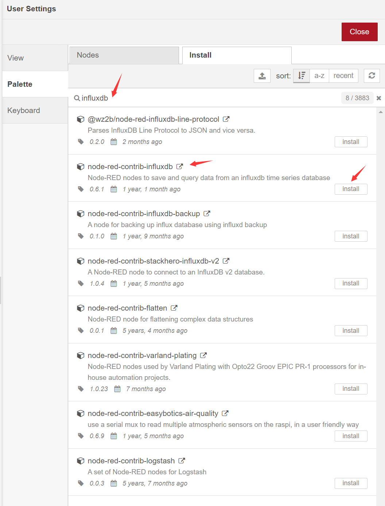
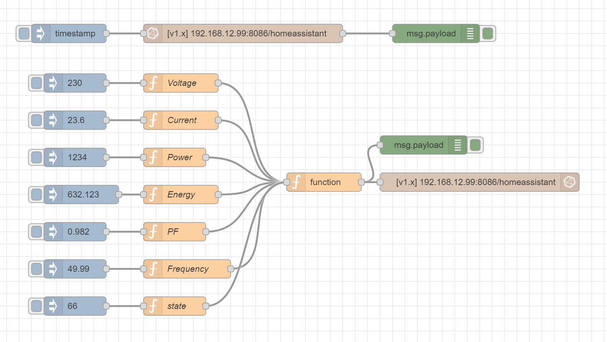
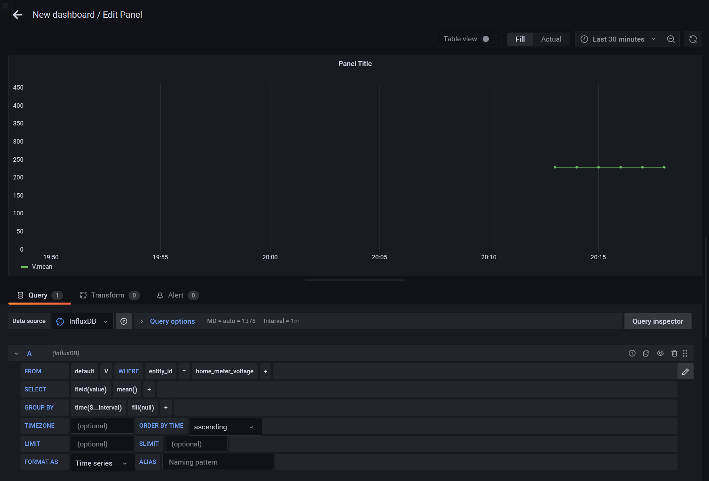

# 将nodered里的电量数据存储到influxdb,方便在grafana展示

首先在你的nodered里安装node-red-contrib-influxdb节点:



然后导入以下流程:

```json
[{"id":"06263bcac5a42fd1","type":"tab","label":"influxdb_DEMO","disabled":false,"info":"","env":[]},{"id":"9c64fad3bf02f85f","type":"debug","z":"06263bcac5a42fd1","name":"","active":true,"tosidebar":true,"console":false,"tostatus":false,"complete":"payload","targetType":"msg","statusVal":"","statusType":"auto","x":770,"y":100,"wires":[]},{"id":"23b56d4e8c55a864","type":"influxdb in","z":"06263bcac5a42fd1","influxdb":"ed5228586bb6bef2","name":"","query":"SELECT * FROM test","rawOutput":false,"precision":"","retentionPolicy":"","org":"my-org","x":460,"y":100,"wires":[["9c64fad3bf02f85f"]]},{"id":"056c109e535c2d7f","type":"inject","z":"06263bcac5a42fd1","name":"","props":[{"p":"payload"},{"p":"topic","vt":"str"}],"repeat":"","crontab":"","once":false,"onceDelay":0.1,"topic":"","payload":"","payloadType":"date","x":180,"y":100,"wires":[["23b56d4e8c55a864"]]},{"id":"134258e1d6cb1824","type":"influxdb batch","z":"06263bcac5a42fd1","influxdb":"ed5228586bb6bef2","precision":"","retentionPolicy":"","name":"","database":"","retentionPolicyV18Flux":"","org":"","bucket":"","x":840,"y":340,"wires":[]},{"id":"9276fc288ef9b7da","type":"function","z":"06263bcac5a42fd1","name":"","func":"var value_tmp = msg.payload;\nvar measurement_tmp = msg.measurement;\nvar friendly_name_str_tmp = msg.name;\nfriendly_name_str_tmp=friendly_name_str_tmp.replace(/ +/g, '_'); \nvar entity_id_tmp = friendly_name_str_tmp.toLowerCase();\n//var entity_id_tmp = msg.entity_id;\n//var friendly_name_str_tmp = entity_id_tmp;\n\n//default\nvar device_class_str_tmp = \"\";\nvar domain_tmp = \"sensor\";\nvar state_class_str_tmp = \"measurement\";\n    \nif(measurement_tmp == \"V\"){\n    device_class_str_tmp = \"voltage\";\n    domain_tmp = \"sensor\";\n    state_class_str_tmp = \"measurement\";\n}\nif(measurement_tmp == \"A\"){\n    device_class_str_tmp = \"current\";\n    domain_tmp = \"sensor\";\n    state_class_str_tmp = \"measurement\";\n}\nif(measurement_tmp == \"W\"){\n    device_class_str_tmp = \"power\";\n    domain_tmp = \"sensor\";\n    state_class_str_tmp = \"measurement\";\n}\nif(measurement_tmp == \"kWh\"){\n    device_class_str_tmp = \"energy\";\n    domain_tmp = \"sensor\";\n    state_class_str_tmp = \"total_increasing\";\n}\nif(measurement_tmp == \"pf\"){\n    measurement_tmp = \"state\"\n    device_class_str_tmp = \"power_factor\";\n    domain_tmp = \"sensor\";\n    state_class_str_tmp = \"measurement\";\n}\nif(measurement_tmp == \"Hz\"){\n    device_class_str_tmp = \"frequency\";\n    domain_tmp = \"sensor\";\n    state_class_str_tmp = \"measurement\";\n}\nif(measurement_tmp == \"\"){\n    measurement_tmp = \"state\"\n    device_class_str_tmp = \"\";\n    domain_tmp = \"sensor\";\n    state_class_str_tmp = \"measurement\";\n}\nif(measurement_tmp == undefined){\n    measurement_tmp = \"state\"\n    device_class_str_tmp = \"\";\n    domain_tmp = \"sensor\";\n    state_class_str_tmp = \"measurement\";\n}\n\nmsg.payload = [\n    {\n        measurement: measurement_tmp,\n        fields: {\n            \"device_class_str\": device_class_str_tmp,\n            \"friendly_name_str\": friendly_name_str_tmp,\n            \"state_class_str\": state_class_str_tmp,\n            \"value\": value_tmp\n        },\n        tags:{\n            \"domain\": domain_tmp,\n            \"entity_id\": entity_id_tmp\n        },\n        timestamp: new Date()\n    }\n];\n\nreturn msg;\n","outputs":1,"noerr":0,"initialize":"","finalize":"","libs":[],"x":590,"y":340,"wires":[["2554a81894bac719","134258e1d6cb1824"]]},{"id":"4cf70a8d60699c14","type":"function","z":"06263bcac5a42fd1","name":"Voltage","func":"\nmsg.measurement = \"V\";\nmsg.name = \"Home Meter Voltage\";\n\nreturn msg;","outputs":1,"noerr":0,"initialize":"","finalize":"","libs":[],"x":360,"y":180,"wires":[["9276fc288ef9b7da"]]},{"id":"2554a81894bac719","type":"debug","z":"06263bcac5a42fd1","name":"","active":true,"tosidebar":true,"console":false,"tostatus":false,"complete":"payload","targetType":"msg","statusVal":"","statusType":"auto","x":750,"y":280,"wires":[]},{"id":"45a9208a9f8168c4","type":"inject","z":"06263bcac5a42fd1","name":"","props":[{"p":"payload"},{"p":"topic","vt":"str"}],"repeat":"","crontab":"","once":false,"onceDelay":"","topic":"","payload":"230","payloadType":"num","x":190,"y":180,"wires":[["4cf70a8d60699c14"]]},{"id":"64f1429aaa46c1f5","type":"function","z":"06263bcac5a42fd1","name":"Current","func":"\nmsg.measurement = \"A\";\nmsg.name = \"Home Meter Current\";\n\nreturn msg;","outputs":1,"noerr":0,"initialize":"","finalize":"","libs":[],"x":360,"y":240,"wires":[["9276fc288ef9b7da"]]},{"id":"ad42e8764b77a9f9","type":"function","z":"06263bcac5a42fd1","name":"Power","func":"\nmsg.measurement = \"W\";\nmsg.name = \"Home Meter Power\";\n\nreturn msg;","outputs":1,"noerr":0,"initialize":"","finalize":"","libs":[],"x":350,"y":300,"wires":[["9276fc288ef9b7da"]]},{"id":"0984f1e57b29cf17","type":"function","z":"06263bcac5a42fd1","name":"Energy","func":"\nmsg.measurement = \"kWh\";\nmsg.name = \"Home Meter Energy\";\n\nreturn msg;","outputs":1,"noerr":0,"initialize":"","finalize":"","libs":[],"x":360,"y":360,"wires":[["9276fc288ef9b7da"]]},{"id":"1e53296af2df1e4d","type":"function","z":"06263bcac5a42fd1","name":"PF","func":"\nmsg.measurement = \"pf\";\nmsg.name = \"Home Meter PF\";\n\nreturn msg;","outputs":1,"noerr":0,"initialize":"","finalize":"","libs":[],"x":350,"y":420,"wires":[["9276fc288ef9b7da"]]},{"id":"69e0cf70c92829f9","type":"function","z":"06263bcac5a42fd1","name":"Frequency","func":"\nmsg.measurement = \"Hz\";\nmsg.name = \"Home Meter Frequency\";\n\nreturn msg;","outputs":1,"noerr":0,"initialize":"","finalize":"","libs":[],"x":370,"y":480,"wires":[["9276fc288ef9b7da"]]},{"id":"9cd9bfcba66aa5ce","type":"inject","z":"06263bcac5a42fd1","name":"","props":[{"p":"payload"},{"p":"topic","vt":"str"}],"repeat":"","crontab":"","once":false,"onceDelay":"","topic":"","payload":"23.6","payloadType":"num","x":190,"y":240,"wires":[["64f1429aaa46c1f5"]]},{"id":"c4339117cfad39ab","type":"inject","z":"06263bcac5a42fd1","name":"","props":[{"p":"payload"},{"p":"topic","vt":"str"}],"repeat":"","crontab":"","once":false,"onceDelay":"","topic":"","payload":"1234","payloadType":"num","x":190,"y":300,"wires":[["ad42e8764b77a9f9"]]},{"id":"e9f633395adefd98","type":"inject","z":"06263bcac5a42fd1","name":"","props":[{"p":"payload"},{"p":"topic","vt":"str"}],"repeat":"","crontab":"","once":false,"onceDelay":"","topic":"","payload":"632.123","payloadType":"num","x":200,"y":360,"wires":[["0984f1e57b29cf17"]]},{"id":"f35c64d4dcc7b5bf","type":"inject","z":"06263bcac5a42fd1","name":"","props":[{"p":"payload"},{"p":"topic","vt":"str"}],"repeat":"","crontab":"","once":false,"onceDelay":"","topic":"","payload":"0.982","payloadType":"num","x":190,"y":420,"wires":[["1e53296af2df1e4d"]]},{"id":"ca7506d0e53deb88","type":"inject","z":"06263bcac5a42fd1","name":"","props":[{"p":"payload"},{"p":"topic","vt":"str"}],"repeat":"","crontab":"","once":false,"onceDelay":"","topic":"","payload":"49.99","payloadType":"num","x":190,"y":480,"wires":[["69e0cf70c92829f9"]]},{"id":"c58c3f435f1c7645","type":"function","z":"06263bcac5a42fd1","name":"state","func":"\n//msg.measurement = \"\";\nmsg.name = \"Home Meter State\";\n\nreturn msg;","outputs":1,"noerr":0,"initialize":"","finalize":"","libs":[],"x":350,"y":540,"wires":[["9276fc288ef9b7da"]]},{"id":"cd7f37a4727c0acf","type":"inject","z":"06263bcac5a42fd1","name":"","props":[{"p":"payload"},{"p":"topic","vt":"str"}],"repeat":"","crontab":"","once":false,"onceDelay":"","topic":"","payload":"66","payloadType":"num","x":190,"y":540,"wires":[["c58c3f435f1c7645"]]},{"id":"ed5228586bb6bef2","type":"influxdb","hostname":"192.168.12.99","port":"8086","protocol":"http","database":"homeassistant","name":"","usetls":false,"tls":"dcf827c4.19bc58","influxdbVersion":"1.x","url":"http://localhost:8086","rejectUnauthorized":true},{"id":"dcf827c4.19bc58","type":"tls-config","name":"","cert":"","key":"","ca":"","certname":"","keyname":"","caname":"","servername":"","verifyservercert":false}]
```



然后就可以在你的grafana里看到对应的数据了:



