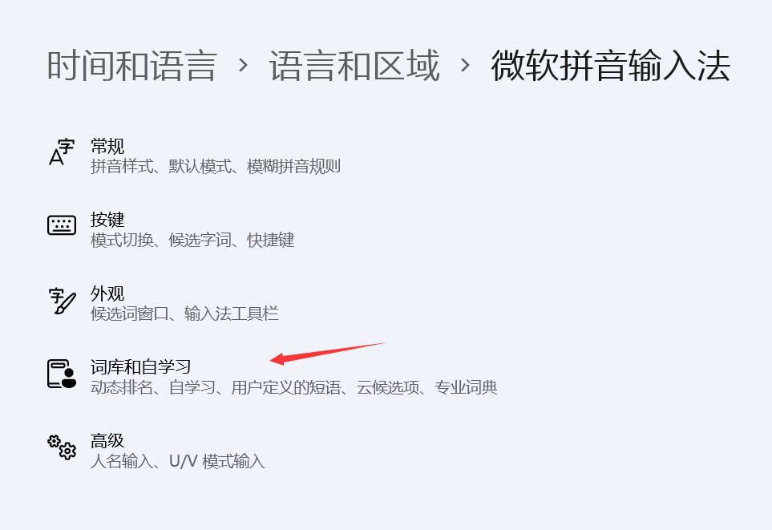
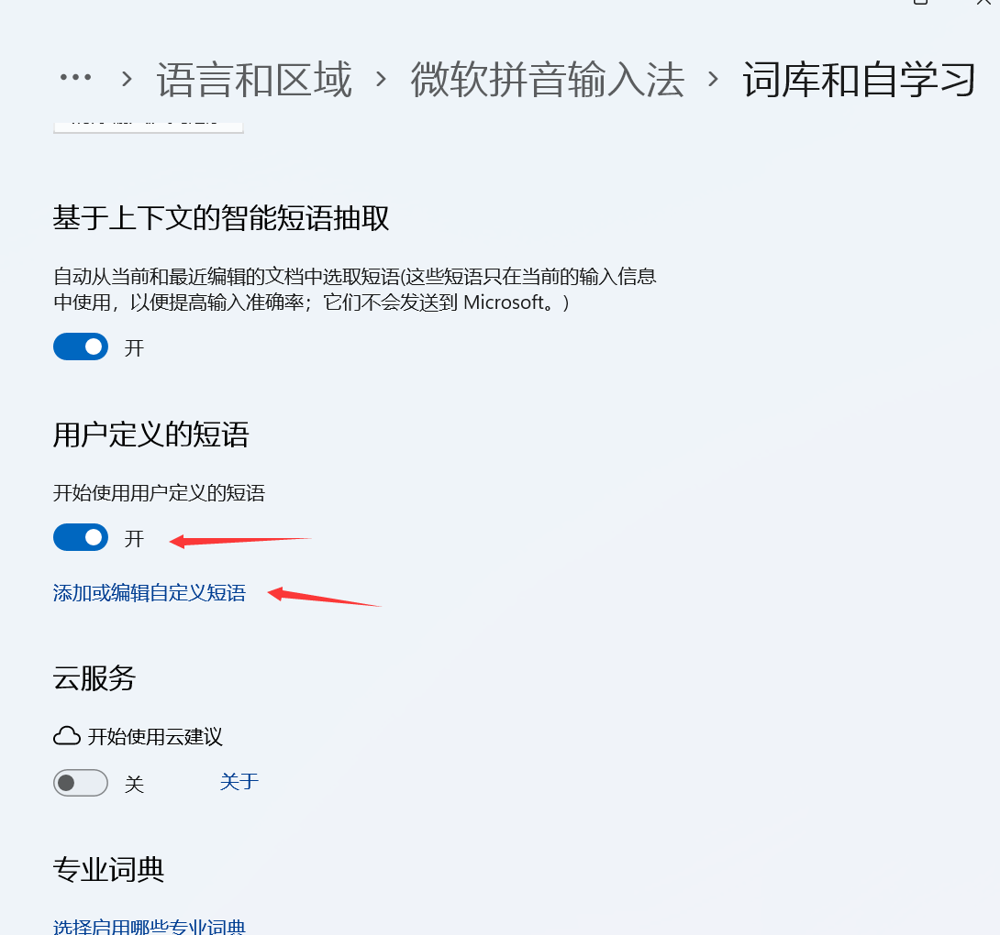
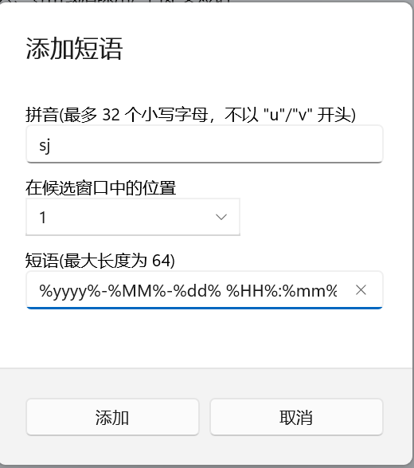

# Win11微软输入法快速输入当前时间

右键微软输⼊法，选择“设置”；


选择"词库和自学习":



找到“用户定义的短语”，点击“添加或编辑⾃定义短语”；



点击“添加”，添加自定义短语；


输入自定义快捷拼⾳，“短语”需要输⼊以下代码，也可以自定义输出格式；

```
%yyyy%-%MM%-%dd% %HH%:%mm%:%ss%
%yyyy%%MM%%dd%_%HH%%mm%%ss%
```



最后，点击“添加”即可，也可通过同样的方式添加地址等，十分方便。

## 
